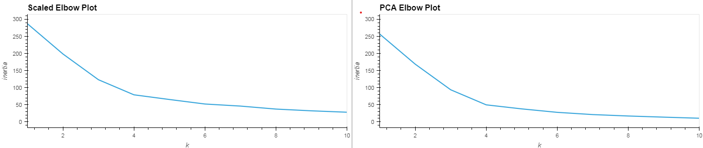

# Unsupervised-Learning_CryptoClustering
Module 19

# Cryptocurrency Clustering Challenge

## Project Description

This repository serves as a hub for the Cryptocurrency Clustering Challenge, incorporating both a primary script and an associated dataset in CSV format. The project is designed to harness Python and unsupervised machine learning techniques to explore how cryptocurrency prices are influenced by fluctuations over 24-hour and 7-day periods.

## Repository Structure
- **Data**
    - **crypto_market_data.csv**: Dataset provided for analysis.
- **Visuals**
    - **elbows.png**: Image showing a scatter plot comparison for the elbow method.
    - **scatters.png**: Image showing a scatter plot comparison for overall data clustering.
- **Notebooks**
    - **Crypto_Clustering.ipynb**: Jupyter Notebook containing all necessary code for analysis.

## Project Outcomes

The core of this challenge revolves around analyzing cryptocurrency market trends. Utilizing the StandardScaler module, market prices were normalized for more accurate comparisons. Our approach involved employing the K-means clustering algorithm alongside the elbow method to determine optimal clustering parameters. Additionally, the project delved into Principal Component Analysis (PCA) to assess whether dimensionality reduction could enhance our clustering strategy.

## Detailed Insights

The application of PCA reduced our feature set to three principal components, capturing approximately 88% of the dataset's variance. This substantial reduction in dimensionality underscores the PCA's effectiveness in maintaining the core characteristics of the data while stripping away redundant information. By implementing the K-means algorithm on both the original scaled data and the PCA-transformed data, we observed that the clustering was significantly improved post-PCA. This improvement suggests that PCA's ability to minimize noise and focus on essential patterns greatly benefits the clustering process, leading to a more distinct and meaningful segmentation of the cryptocurrency market data.

    

The transition to a reduced feature space through PCA not only clarified the cluster formations but also emphasized the algorithm's efficiency in highlighting relevant market trends, despite the reduced complexity of the dataset.

    

## How to Utilize This Repository

Follow these steps to conduct your own analysis using the provided materials:

1. Launch the `Crypto_Clustering.ipynb` notebook within a Jupyter Notebook environment.

2. Ensure the paths for the dataset and output files align with those specified in the notebook; adjust if necessary.

3. Execute the code cells sequentially to perform the analysis and view the results.
